# Sequence Diagrams — FlowBoard (Jira Copycat)

> **Conventions**
> - **No HTTP status codes** — responses use descriptive labels (e.g. `return user data()`, `return error: not found()`)
> - **No Database actor** — persistence is implied inside the Backend API
> - Actors: `User` / `Supervisor` / `Member`, `Frontend`, `BackendAPI`
> - Each use case has **Normal Case**, optional **Alternate Case(s)**, and **Exception(s)**

---

## 1. Authentication

### 1.1 Register

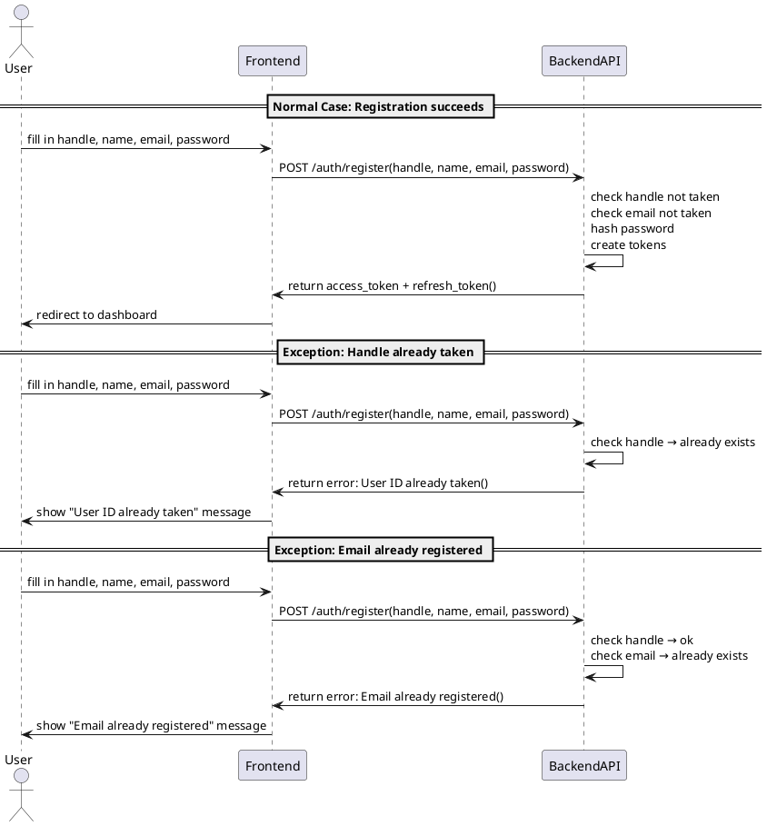
```plantuml
@startuml SD-1.1-Register
actor User
participant Frontend
participant BackendAPI

== Normal Case: Registration succeeds ==

User -> Frontend: fill in handle, name, email, password
Frontend -> BackendAPI: POST /auth/register(handle, name, email, password)
BackendAPI -> BackendAPI: check handle not taken\ncheck email not taken\nhash password\ncreate tokens
BackendAPI -> Frontend: return access_token + refresh_token()
Frontend -> User: redirect to dashboard

== Exception: Handle already taken ==

User -> Frontend: fill in handle, name, email, password
Frontend -> BackendAPI: POST /auth/register(handle, name, email, password)
BackendAPI -> BackendAPI: check handle → already exists
BackendAPI -> Frontend: return error: User ID already taken()
Frontend -> User: show "User ID already taken" message

== Exception: Email already registered ==

User -> Frontend: fill in handle, name, email, password
Frontend -> BackendAPI: POST /auth/register(handle, name, email, password)
BackendAPI -> BackendAPI: check handle → ok\ncheck email → already exists
BackendAPI -> Frontend: return error: Email already registered()
Frontend -> User: show "Email already registered" message
@enduml
```

### 1.2 Login

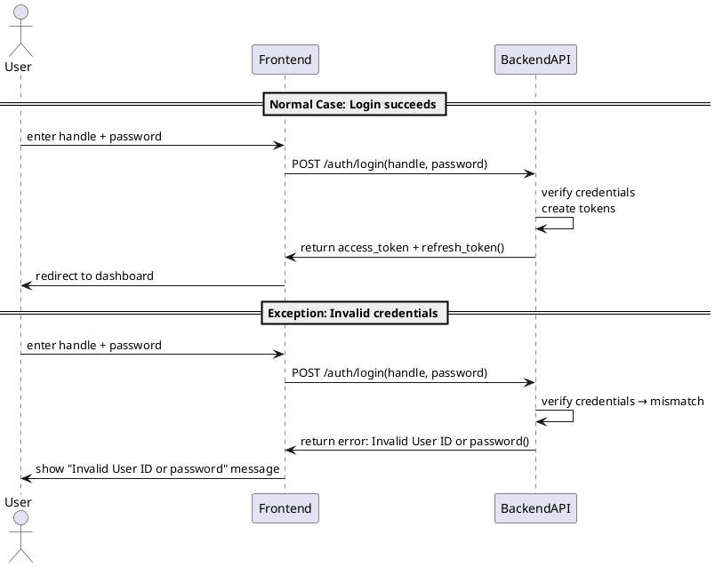
```plantuml
@startuml SD-1.2-Login
actor User
participant Frontend
participant BackendAPI

== Normal Case: Login succeeds ==

User -> Frontend: enter handle + password
Frontend -> BackendAPI: POST /auth/login(handle, password)
BackendAPI -> BackendAPI: verify credentials\ncreate tokens
BackendAPI -> Frontend: return access_token + refresh_token()
Frontend -> User: redirect to dashboard

== Exception: Invalid credentials ==

User -> Frontend: enter handle + password
Frontend -> BackendAPI: POST /auth/login(handle, password)
BackendAPI -> BackendAPI: verify credentials → mismatch
BackendAPI -> Frontend: return error: Invalid User ID or password()
Frontend -> User: show "Invalid User ID or password" message
@enduml
```

### 1.3 Logout

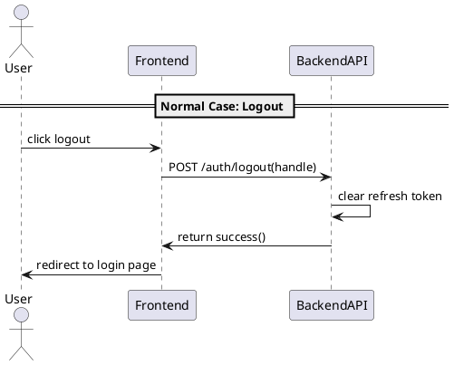
```plantuml
@startuml SD-1.3-Logout
actor User
participant Frontend
participant BackendAPI

== Normal Case: Logout ==

User -> Frontend: click logout
Frontend -> BackendAPI: POST /auth/logout(handle)
BackendAPI -> BackendAPI: clear refresh token
BackendAPI -> Frontend: return success()
Frontend -> User: redirect to login page
@enduml
```

### 1.4 Forgot Password

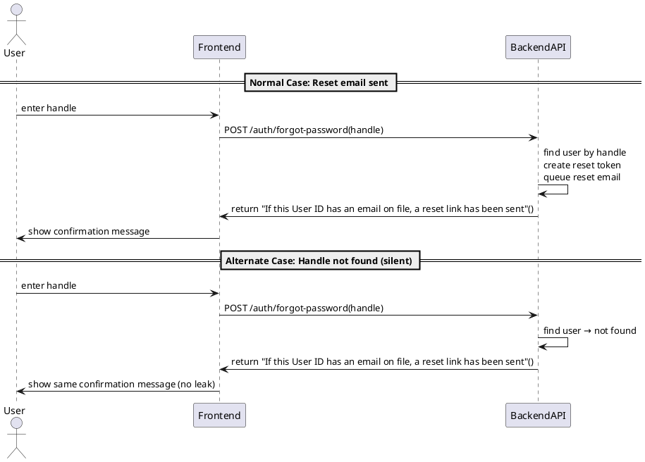
```plantuml
@startuml SD-1.4-ForgotPassword
actor User
participant Frontend
participant BackendAPI

== Normal Case: Reset email sent ==

User -> Frontend: enter handle
Frontend -> BackendAPI: POST /auth/forgot-password(handle)
BackendAPI -> BackendAPI: find user by handle\ncreate reset token\nqueue reset email
BackendAPI -> Frontend: return "If this User ID has an email on file, a reset link has been sent"()
Frontend -> User: show confirmation message

== Alternate Case: Handle not found (silent) ==

User -> Frontend: enter handle
Frontend -> BackendAPI: POST /auth/forgot-password(handle)
BackendAPI -> BackendAPI: find user → not found
BackendAPI -> Frontend: return "If this User ID has an email on file, a reset link has been sent"()
Frontend -> User: show same confirmation message (no leak)
@enduml
```

### 1.5 Reset Password

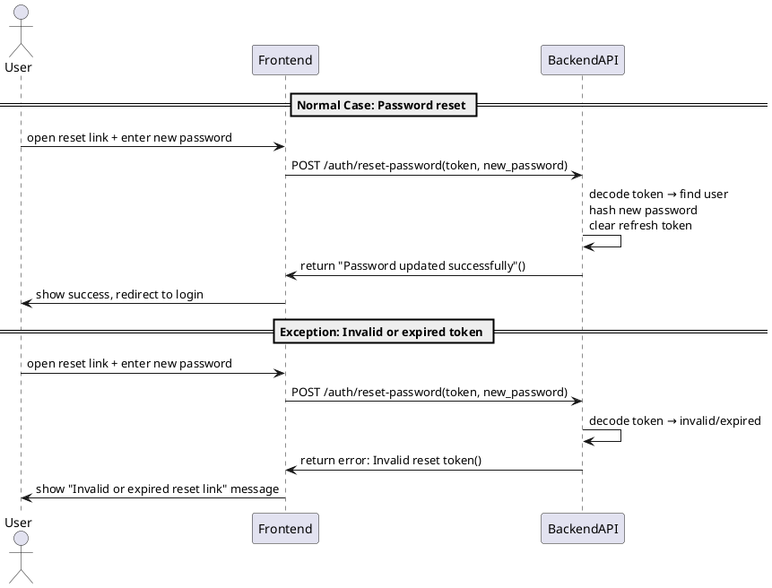
```plantuml
@startuml SD-1.5-ResetPassword
actor User
participant Frontend
participant BackendAPI

== Normal Case: Password reset ==

User -> Frontend: open reset link + enter new password
Frontend -> BackendAPI: POST /auth/reset-password(token, new_password)
BackendAPI -> BackendAPI: decode token → find user\nhash new password\nclear refresh token
BackendAPI -> Frontend: return "Password updated successfully"()
Frontend -> User: show success, redirect to login

== Exception: Invalid or expired token ==

User -> Frontend: open reset link + enter new password
Frontend -> BackendAPI: POST /auth/reset-password(token, new_password)
BackendAPI -> BackendAPI: decode token → invalid/expired
BackendAPI -> Frontend: return error: Invalid reset token()
Frontend -> User: show "Invalid or expired reset link" message
@enduml
```

### 1.6 Refresh Token

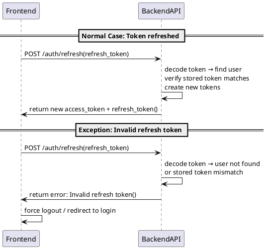
```plantuml
@startuml SD-1.6-RefreshToken
participant Frontend
participant BackendAPI

== Normal Case: Token refreshed ==

Frontend -> BackendAPI: POST /auth/refresh(refresh_token)
BackendAPI -> BackendAPI: decode token → find user\nverify stored token matches\ncreate new tokens
BackendAPI -> Frontend: return new access_token + refresh_token()

== Exception: Invalid refresh token ==

Frontend -> BackendAPI: POST /auth/refresh(refresh_token)
BackendAPI -> BackendAPI: decode token → user not found\nor stored token mismatch
BackendAPI -> Frontend: return error: Invalid refresh token()
Frontend -> Frontend: force logout / redirect to login
@enduml
```

---

## 2. Profile

### 2.1 View Profile

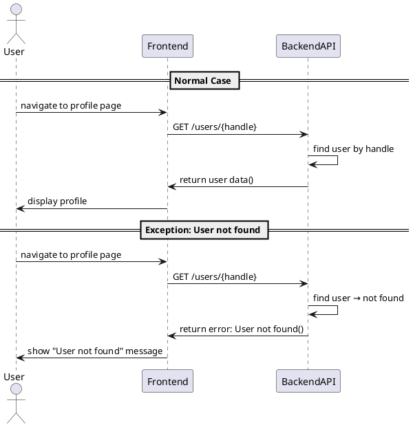
```plantuml
@startuml SD-2.1-ViewProfile
actor User
participant Frontend
participant BackendAPI

== Normal Case ==

User -> Frontend: navigate to profile page
Frontend -> BackendAPI: GET /users/{handle}
BackendAPI -> BackendAPI: find user by handle
BackendAPI -> Frontend: return user data()
Frontend -> User: display profile

== Exception: User not found ==

User -> Frontend: navigate to profile page
Frontend -> BackendAPI: GET /users/{handle}
BackendAPI -> BackendAPI: find user → not found
BackendAPI -> Frontend: return error: User not found()
Frontend -> User: show "User not found" message
@enduml
```

### 2.2 Update Profile

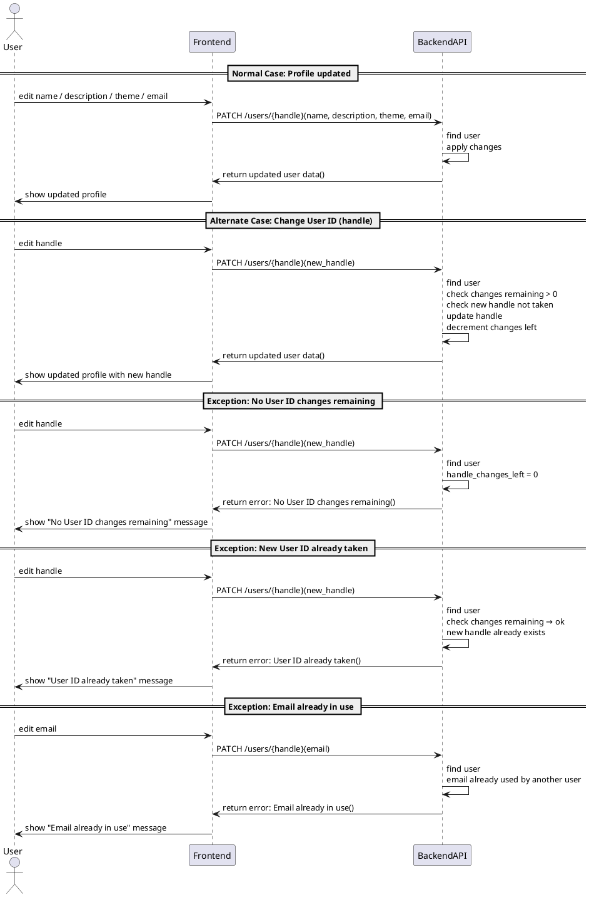
```plantuml
@startuml SD-2.2-UpdateProfile
actor User
participant Frontend
participant BackendAPI

== Normal Case: Profile updated ==

User -> Frontend: edit name / description / theme / email
Frontend -> BackendAPI: PATCH /users/{handle}(name, description, theme, email)
BackendAPI -> BackendAPI: find user\napply changes
BackendAPI -> Frontend: return updated user data()
Frontend -> User: show updated profile

== Alternate Case: Change User ID (handle) ==

User -> Frontend: edit handle
Frontend -> BackendAPI: PATCH /users/{handle}(new_handle)
BackendAPI -> BackendAPI: find user\ncheck changes remaining > 0\ncheck new handle not taken\nupdate handle\ndecrement changes left
BackendAPI -> Frontend: return updated user data()
Frontend -> User: show updated profile with new handle

== Exception: No User ID changes remaining ==

User -> Frontend: edit handle
Frontend -> BackendAPI: PATCH /users/{handle}(new_handle)
BackendAPI -> BackendAPI: find user\nhandle_changes_left = 0
BackendAPI -> Frontend: return error: No User ID changes remaining()
Frontend -> User: show "No User ID changes remaining" message

== Exception: New User ID already taken ==

User -> Frontend: edit handle
Frontend -> BackendAPI: PATCH /users/{handle}(new_handle)
BackendAPI -> BackendAPI: find user\ncheck changes remaining → ok\nnew handle already exists
BackendAPI -> Frontend: return error: User ID already taken()
Frontend -> User: show "User ID already taken" message

== Exception: Email already in use ==

User -> Frontend: edit email
Frontend -> BackendAPI: PATCH /users/{handle}(email)
BackendAPI -> BackendAPI: find user\nemail already used by another user
BackendAPI -> Frontend: return error: Email already in use()
Frontend -> User: show "Email already in use" message
@enduml
```

### 2.3 Upload Avatar

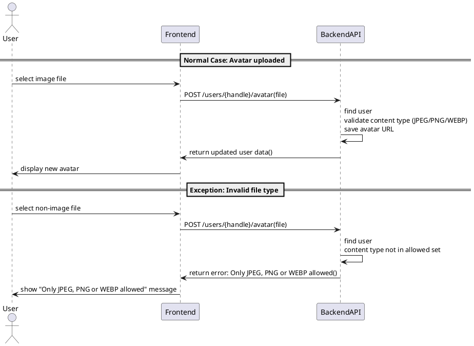
```plantuml
@startuml SD-2.3-UploadAvatar
actor User
participant Frontend
participant BackendAPI

== Normal Case: Avatar uploaded ==

User -> Frontend: select image file
Frontend -> BackendAPI: POST /users/{handle}/avatar(file)
BackendAPI -> BackendAPI: find user\nvalidate content type (JPEG/PNG/WEBP)\nsave avatar URL
BackendAPI -> Frontend: return updated user data()
Frontend -> User: display new avatar

== Exception: Invalid file type ==

User -> Frontend: select non-image file
Frontend -> BackendAPI: POST /users/{handle}/avatar(file)
BackendAPI -> BackendAPI: find user\ncontent type not in allowed set
BackendAPI -> Frontend: return error: Only JPEG, PNG or WEBP allowed()
Frontend -> User: show "Only JPEG, PNG or WEBP allowed" message
@enduml
```

### 2.4 Change Password

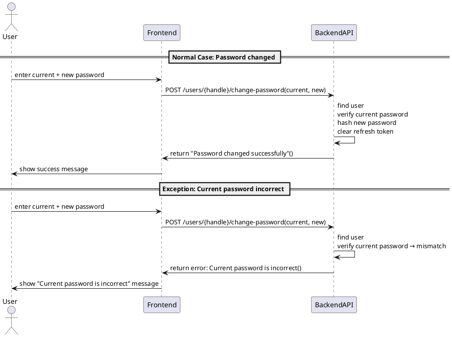
```plantuml
@startuml SD-2.4-ChangePassword
actor User
participant Frontend
participant BackendAPI

== Normal Case: Password changed ==

User -> Frontend: enter current + new password
Frontend -> BackendAPI: POST /users/{handle}/change-password(current, new)
BackendAPI -> BackendAPI: find user\nverify current password\nhash new password\nclear refresh token
BackendAPI -> Frontend: return "Password changed successfully"()
Frontend -> User: show success message

== Exception: Current password incorrect ==

User -> Frontend: enter current + new password
Frontend -> BackendAPI: POST /users/{handle}/change-password(current, new)
BackendAPI -> BackendAPI: find user\nverify current password → mismatch
BackendAPI -> Frontend: return error: Current password is incorrect()
Frontend -> User: show "Current password is incorrect" message
@enduml
```

---

## 3. Courses

### 3.1 List My Courses

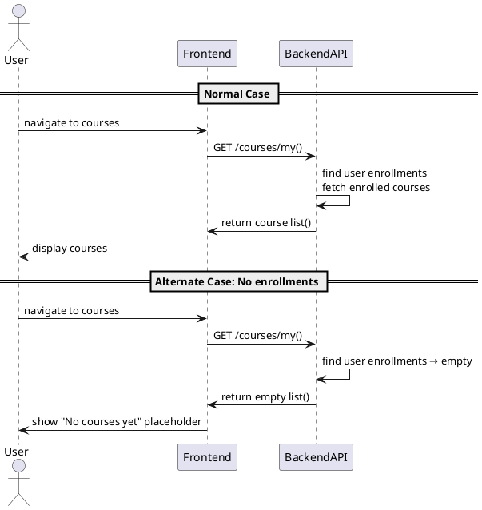
```plantuml
@startuml SD-3.1-ListMyCourses
actor User
participant Frontend
participant BackendAPI

== Normal Case ==

User -> Frontend: navigate to courses
Frontend -> BackendAPI: GET /courses/my()
BackendAPI -> BackendAPI: find user enrollments\nfetch enrolled courses
BackendAPI -> Frontend: return course list()
Frontend -> User: display courses

== Alternate Case: No enrollments ==

User -> Frontend: navigate to courses
Frontend -> BackendAPI: GET /courses/my()
BackendAPI -> BackendAPI: find user enrollments → empty
BackendAPI -> Frontend: return empty list()
Frontend -> User: show "No courses yet" placeholder
@enduml
```

### 3.2 List Courses by Type

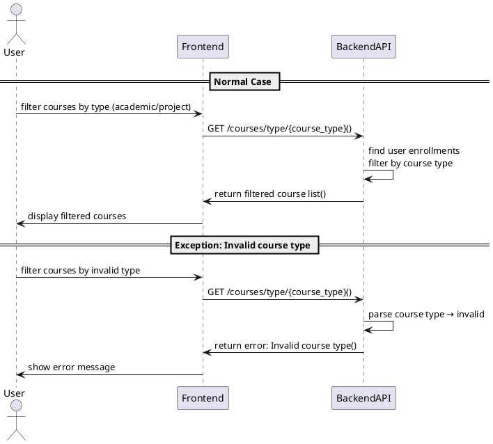
```plantuml
@startuml SD-3.2-ListCoursesByType
actor User
participant Frontend
participant BackendAPI

== Normal Case ==

User -> Frontend: filter courses by type (academic/project)
Frontend -> BackendAPI: GET /courses/type/{course_type}()
BackendAPI -> BackendAPI: find user enrollments\nfilter by course type
BackendAPI -> Frontend: return filtered course list()
Frontend -> User: display filtered courses

== Exception: Invalid course type ==

User -> Frontend: filter courses by invalid type
Frontend -> BackendAPI: GET /courses/type/{course_type}()
BackendAPI -> BackendAPI: parse course type → invalid
BackendAPI -> Frontend: return error: Invalid course type()
Frontend -> User: show error message
@enduml
```

### 3.3 Get Course Detail

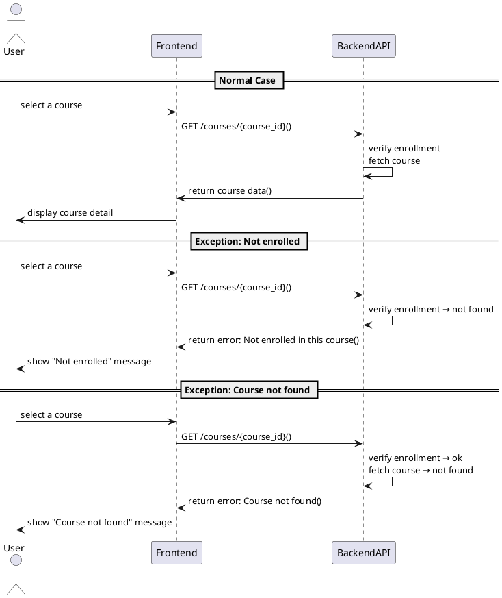
```plantuml
@startuml SD-3.3-GetCourseDetail
actor User
participant Frontend
participant BackendAPI

== Normal Case ==

User -> Frontend: select a course
Frontend -> BackendAPI: GET /courses/{course_id}()
BackendAPI -> BackendAPI: verify enrollment\nfetch course
BackendAPI -> Frontend: return course data()
Frontend -> User: display course detail

== Exception: Not enrolled ==

User -> Frontend: select a course
Frontend -> BackendAPI: GET /courses/{course_id}()
BackendAPI -> BackendAPI: verify enrollment → not found
BackendAPI -> Frontend: return error: Not enrolled in this course()
Frontend -> User: show "Not enrolled" message

== Exception: Course not found ==

User -> Frontend: select a course
Frontend -> BackendAPI: GET /courses/{course_id}()
BackendAPI -> BackendAPI: verify enrollment → ok\nfetch course → not found
BackendAPI -> Frontend: return error: Course not found()
Frontend -> User: show "Course not found" message
@enduml
```

### 3.4 Get Course Teams

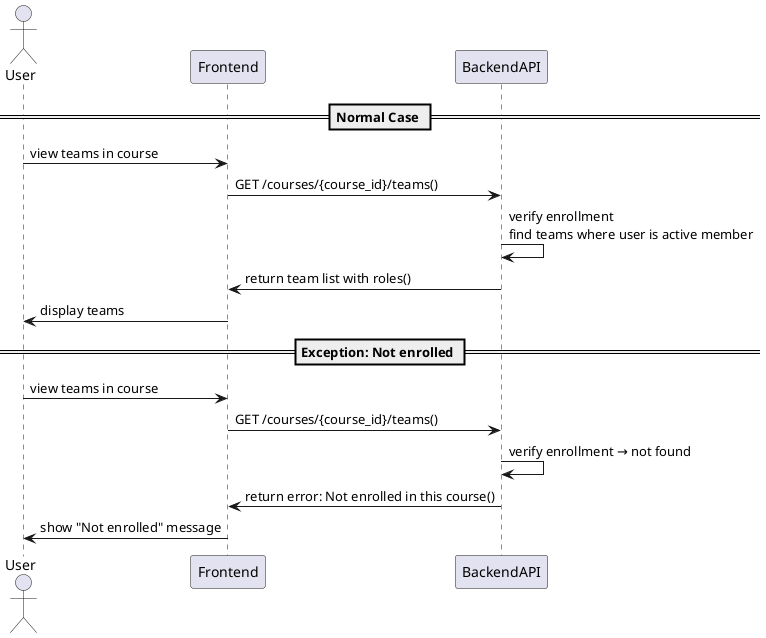
```plantuml
@startuml SD-3.4-GetCourseTeams
actor User
participant Frontend
participant BackendAPI

== Normal Case ==

User -> Frontend: view teams in course
Frontend -> BackendAPI: GET /courses/{course_id}/teams()
BackendAPI -> BackendAPI: verify enrollment\nfind teams where user is active member
BackendAPI -> Frontend: return team list with roles()
Frontend -> User: display teams

== Exception: Not enrolled ==

User -> Frontend: view teams in course
Frontend -> BackendAPI: GET /courses/{course_id}/teams()
BackendAPI -> BackendAPI: verify enrollment → not found
BackendAPI -> Frontend: return error: Not enrolled in this course()
Frontend -> User: show "Not enrolled" message
@enduml
```

---

## 4. Teams

### 4.1 Create Team

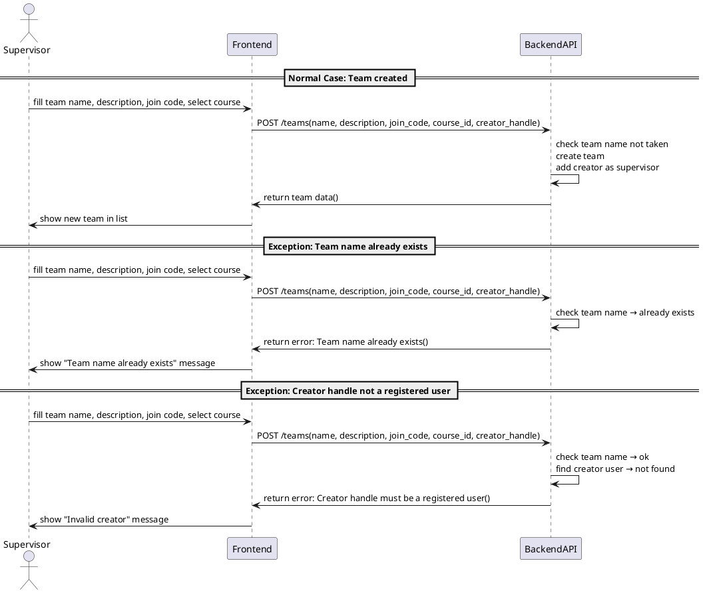
```plantuml
@startuml SD-4.1-CreateTeam
actor Supervisor
participant Frontend
participant BackendAPI

== Normal Case: Team created ==

Supervisor -> Frontend: fill team name, description, join code, select course
Frontend -> BackendAPI: POST /teams(name, description, join_code, course_id, creator_handle)
BackendAPI -> BackendAPI: check team name not taken\ncreate team\nadd creator as supervisor
BackendAPI -> Frontend: return team data()
Frontend -> Supervisor: show new team in list

== Exception: Team name already exists ==

Supervisor -> Frontend: fill team name, description, join code, select course
Frontend -> BackendAPI: POST /teams(name, description, join_code, course_id, creator_handle)
BackendAPI -> BackendAPI: check team name → already exists
BackendAPI -> Frontend: return error: Team name already exists()
Frontend -> Supervisor: show "Team name already exists" message

== Exception: Creator handle not a registered user ==

Supervisor -> Frontend: fill team name, description, join code, select course
Frontend -> BackendAPI: POST /teams(name, description, join_code, course_id, creator_handle)
BackendAPI -> BackendAPI: check team name → ok\nfind creator user → not found
BackendAPI -> Frontend: return error: Creator handle must be a registered user()
Frontend -> Supervisor: show "Invalid creator" message
@enduml
```

### 4.2 List Teams

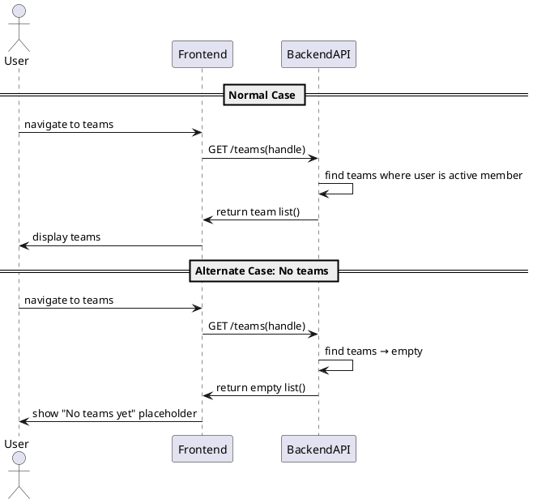
```plantuml
@startuml SD-4.2-ListTeams
actor User
participant Frontend
participant BackendAPI

== Normal Case ==

User -> Frontend: navigate to teams
Frontend -> BackendAPI: GET /teams(handle)
BackendAPI -> BackendAPI: find teams where user is active member
BackendAPI -> Frontend: return team list()
Frontend -> User: display teams

== Alternate Case: No teams ==

User -> Frontend: navigate to teams
Frontend -> BackendAPI: GET /teams(handle)
BackendAPI -> BackendAPI: find teams → empty
BackendAPI -> Frontend: return empty list()
Frontend -> User: show "No teams yet" placeholder
@enduml
```

### 4.3 Join Team (Request to Join)

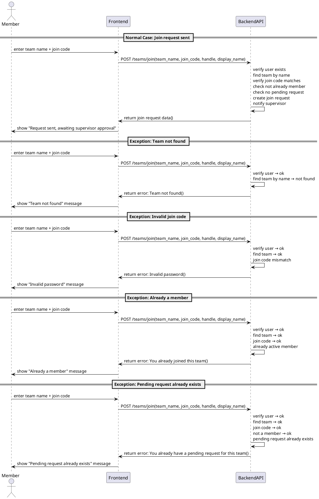
```plantuml
@startuml SD-4.3-JoinTeam
actor Member
participant Frontend
participant BackendAPI

== Normal Case: Join request sent ==

Member -> Frontend: enter team name + join code
Frontend -> BackendAPI: POST /teams/join(team_name, join_code, handle, display_name)
BackendAPI -> BackendAPI: verify user exists\nfind team by name\nverify join code matches\ncheck not already member\ncheck no pending request\ncreate join request\nnotify supervisor
BackendAPI -> Frontend: return join request data()
Frontend -> Member: show "Request sent, awaiting supervisor approval"

== Exception: Team not found ==

Member -> Frontend: enter team name + join code
Frontend -> BackendAPI: POST /teams/join(team_name, join_code, handle, display_name)
BackendAPI -> BackendAPI: verify user → ok\nfind team by name → not found
BackendAPI -> Frontend: return error: Team not found()
Frontend -> Member: show "Team not found" message

== Exception: Invalid join code ==

Member -> Frontend: enter team name + join code
Frontend -> BackendAPI: POST /teams/join(team_name, join_code, handle, display_name)
BackendAPI -> BackendAPI: verify user → ok\nfind team → ok\njoin code mismatch
BackendAPI -> Frontend: return error: Invalid password()
Frontend -> Member: show "Invalid password" message

== Exception: Already a member ==

Member -> Frontend: enter team name + join code
Frontend -> BackendAPI: POST /teams/join(team_name, join_code, handle, display_name)
BackendAPI -> BackendAPI: verify user → ok\nfind team → ok\njoin code → ok\nalready active member
BackendAPI -> Frontend: return error: You already joined this team()
Frontend -> Member: show "Already a member" message

== Exception: Pending request already exists ==

Member -> Frontend: enter team name + join code
Frontend -> BackendAPI: POST /teams/join(team_name, join_code, handle, display_name)
BackendAPI -> BackendAPI: verify user → ok\nfind team → ok\njoin code → ok\nnot a member → ok\npending request already exists
BackendAPI -> Frontend: return error: You already have a pending request for this team()
Frontend -> Member: show "Pending request already exists" message
@enduml
```

### 4.4 Approve Join Request

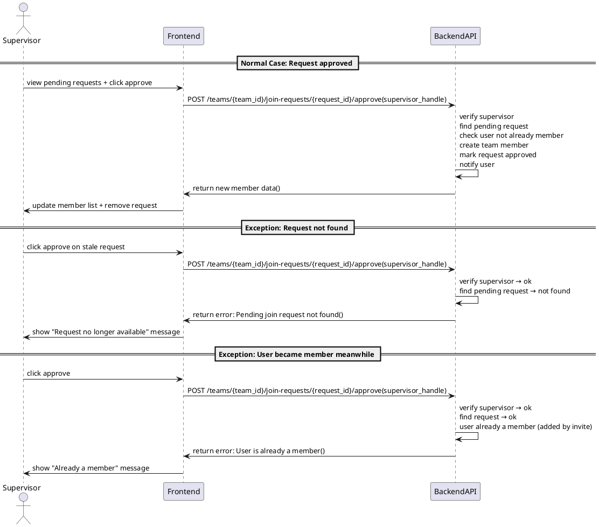
```plantuml
@startuml SD-4.4-ApproveJoinRequest
actor Supervisor
participant Frontend
participant BackendAPI

== Normal Case: Request approved ==

Supervisor -> Frontend: view pending requests + click approve
Frontend -> BackendAPI: POST /teams/{team_id}/join-requests/{request_id}/approve(supervisor_handle)
BackendAPI -> BackendAPI: verify supervisor\nfind pending request\ncheck user not already member\ncreate team member\nmark request approved\nnotify user
BackendAPI -> Frontend: return new member data()
Frontend -> Supervisor: update member list + remove request

== Exception: Request not found ==

Supervisor -> Frontend: click approve on stale request
Frontend -> BackendAPI: POST /teams/{team_id}/join-requests/{request_id}/approve(supervisor_handle)
BackendAPI -> BackendAPI: verify supervisor → ok\nfind pending request → not found
BackendAPI -> Frontend: return error: Pending join request not found()
Frontend -> Supervisor: show "Request no longer available" message

== Exception: User became member meanwhile ==

Supervisor -> Frontend: click approve
Frontend -> BackendAPI: POST /teams/{team_id}/join-requests/{request_id}/approve(supervisor_handle)
BackendAPI -> BackendAPI: verify supervisor → ok\nfind request → ok\nuser already a member (added by invite)
BackendAPI -> Frontend: return error: User is already a member()
Frontend -> Supervisor: show "Already a member" message
@enduml
```

### 4.5 Reject Join Request

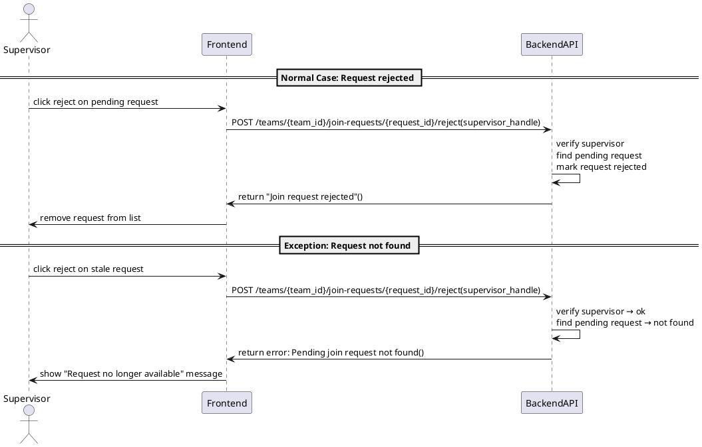
```plantuml
@startuml SD-4.5-RejectJoinRequest
actor Supervisor
participant Frontend
participant BackendAPI

== Normal Case: Request rejected ==

Supervisor -> Frontend: click reject on pending request
Frontend -> BackendAPI: POST /teams/{team_id}/join-requests/{request_id}/reject(supervisor_handle)
BackendAPI -> BackendAPI: verify supervisor\nfind pending request\nmark request rejected
BackendAPI -> Frontend: return "Join request rejected"()
Frontend -> Supervisor: remove request from list

== Exception: Request not found ==

Supervisor -> Frontend: click reject on stale request
Frontend -> BackendAPI: POST /teams/{team_id}/join-requests/{request_id}/reject(supervisor_handle)
BackendAPI -> BackendAPI: verify supervisor → ok\nfind pending request → not found
BackendAPI -> Frontend: return error: Pending join request not found()
Frontend -> Supervisor: show "Request no longer available" message
@enduml
```

### 4.6 Invite Member

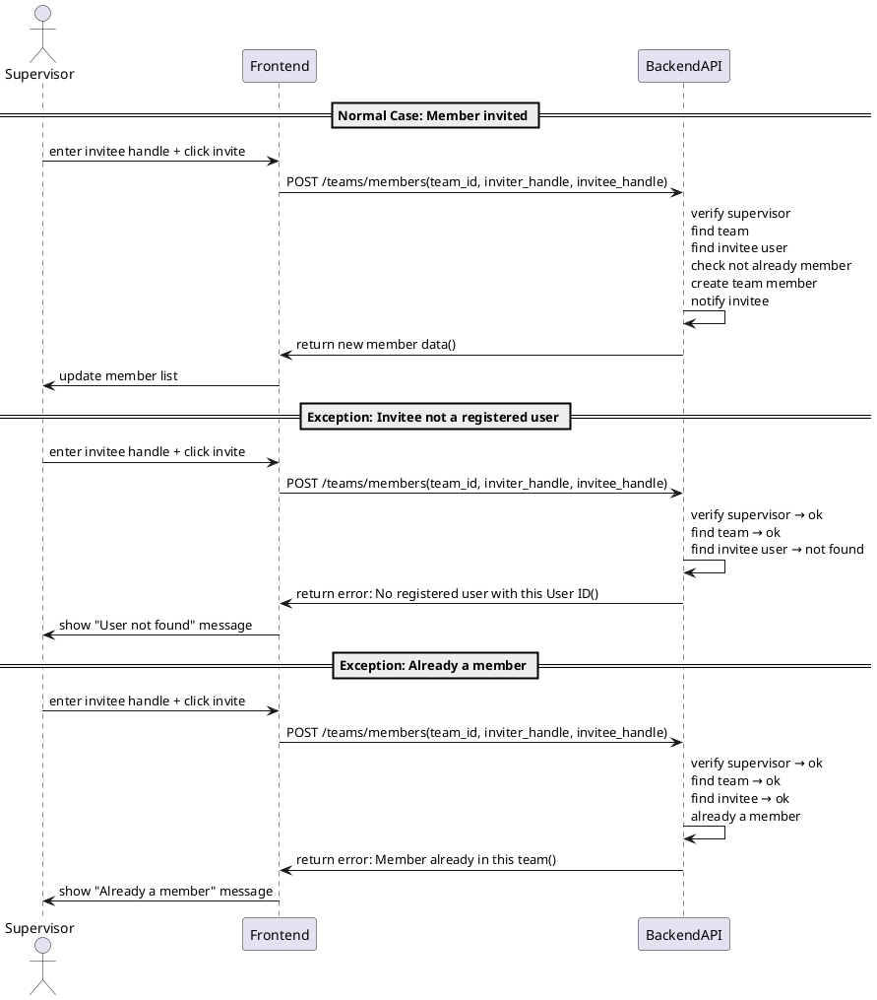
```plantuml
@startuml SD-4.6-InviteMember
actor Supervisor
participant Frontend
participant BackendAPI

== Normal Case: Member invited ==

Supervisor -> Frontend: enter invitee handle + click invite
Frontend -> BackendAPI: POST /teams/members(team_id, inviter_handle, invitee_handle)
BackendAPI -> BackendAPI: verify supervisor\nfind team\nfind invitee user\ncheck not already member\ncreate team member\nnotify invitee
BackendAPI -> Frontend: return new member data()
Frontend -> Supervisor: update member list

== Exception: Invitee not a registered user ==

Supervisor -> Frontend: enter invitee handle + click invite
Frontend -> BackendAPI: POST /teams/members(team_id, inviter_handle, invitee_handle)
BackendAPI -> BackendAPI: verify supervisor → ok\nfind team → ok\nfind invitee user → not found
BackendAPI -> Frontend: return error: No registered user with this User ID()
Frontend -> Supervisor: show "User not found" message

== Exception: Already a member ==

Supervisor -> Frontend: enter invitee handle + click invite
Frontend -> BackendAPI: POST /teams/members(team_id, inviter_handle, invitee_handle)
BackendAPI -> BackendAPI: verify supervisor → ok\nfind team → ok\nfind invitee → ok\nalready a member
BackendAPI -> Frontend: return error: Member already in this team()
Frontend -> Supervisor: show "Already a member" message
@enduml
```

### 4.7 Remove Member

```plantuml
@startuml SD-4.7-RemoveMember
actor Supervisor
participant Frontend
participant BackendAPI

== Normal Case: Member removed ==

Supervisor -> Frontend: click remove on member
Frontend -> BackendAPI: DELETE /teams/members/{member_id}(supervisor_handle)
BackendAPI -> BackendAPI: find member\nverify supervisor\ncannot remove supervisor/lead\nset is_active = false
BackendAPI -> Frontend: return "Member removed"()
Frontend -> Supervisor: update member list

== Exception: Member not found ==

Supervisor -> Frontend: click remove on member
Frontend -> BackendAPI: DELETE /teams/members/{member_id}(supervisor_handle)
BackendAPI -> BackendAPI: find member → not found
BackendAPI -> Frontend: return error: Member not found()
Frontend -> Supervisor: show "Member not found" message

== Exception: Cannot remove supervisor/lead ==

Supervisor -> Frontend: click remove on supervisor/lead
Frontend -> BackendAPI: DELETE /teams/members/{member_id}(supervisor_handle)
BackendAPI -> BackendAPI: find member → ok\nverify supervisor → ok\nmember is supervisor/lead
BackendAPI -> Frontend: return error: Cannot remove the team supervisor()
Frontend -> Supervisor: show "Cannot remove supervisor" message
@enduml
```

---

## 5. Tasks

### 5.1 Create Task

```plantuml
@startuml SD-5.1-CreateTask
actor Supervisor
participant Frontend
participant BackendAPI

== Normal Case: Task created ==

Supervisor -> Frontend: fill task name, description, category, deadline, assignee
Frontend -> BackendAPI: POST /tasks(team_id, creator_handle, name, description, category, deadline, assignee_id)
BackendAPI -> BackendAPI: verify membership + supervisor role\ncreate task\nlog "create_task"\nnotify assignee if assigned
BackendAPI -> Frontend: return task data()
Frontend -> Supervisor: show new task on board

== Exception: Not a team member ==

Supervisor -> Frontend: fill task details
Frontend -> BackendAPI: POST /tasks(team_id, creator_handle, ...)
BackendAPI -> BackendAPI: verify membership → not a member
BackendAPI -> Frontend: return error: You are not a member of this team()
Frontend -> Supervisor: show "Not a member" message

== Exception: Not a supervisor ==

Supervisor -> Frontend: fill task details
Frontend -> BackendAPI: POST /tasks(team_id, creator_handle, ...)
BackendAPI -> BackendAPI: verify membership → ok\ncheck supervisor → not supervisor
BackendAPI -> Frontend: return error: Only the team supervisor can create tasks()
Frontend -> Supervisor: show "Only supervisor can create tasks" message
@enduml
```

### 5.2 List Tasks / Kanban View

```plantuml
@startuml SD-5.2-ListTasks
actor Member
participant Frontend
participant BackendAPI

== Normal Case: Tasks loaded ==

Member -> Frontend: select team
Frontend -> BackendAPI: GET /tasks(team_id, [category], [status])
BackendAPI -> BackendAPI: fetch tasks filtered by team, status, category
BackendAPI -> Frontend: return task list()
Frontend -> Member: display task list

Frontend -> BackendAPI: GET /tasks/kanban(team_id)
BackendAPI -> BackendAPI: group tasks by status
BackendAPI -> Frontend: return kanban board data()
Frontend -> Member: display kanban board

== Alternate Case: No tasks ==

Member -> Frontend: select team
Frontend -> BackendAPI: GET /tasks(team_id)
BackendAPI -> BackendAPI: fetch tasks → empty
BackendAPI -> Frontend: return empty list()
Frontend -> Member: show "No tasks yet" placeholder
@enduml
```

### 5.3 Get Task Detail

```plantuml
@startuml SD-5.3-GetTaskDetail
actor Member
participant Frontend
participant BackendAPI

== Normal Case ==

Member -> Frontend: click on task card
Frontend -> BackendAPI: GET /tasks/{task_id}
BackendAPI -> BackendAPI: find task
BackendAPI -> Frontend: return task data()
Frontend -> Frontend: fetch subtasks, logs, submissions
Frontend -> Member: display task detail dialog

== Exception: Task not found ==

Member -> Frontend: click on task card
Frontend -> BackendAPI: GET /tasks/{task_id}
BackendAPI -> BackendAPI: find task → not found
BackendAPI -> Frontend: return error: Task not found()
Frontend -> Member: show "Task not found" message
@enduml
```

### 5.4 Update Task

```plantuml
@startuml SD-5.4-UpdateTask
actor Member
participant Frontend
participant BackendAPI

== Normal Case: Task updated ==

Member -> Frontend: edit task field (status, assignee, name, etc.)
Frontend -> BackendAPI: PATCH /tasks/{task_id}(fields to update)
BackendAPI -> BackendAPI: find task\ncheck not closed\napply changes\nif assignee changed → notify new assignee\nlog "update_task"
BackendAPI -> Frontend: return updated task data()
Frontend -> Member: refresh task display

== Exception: Task not found ==

Member -> Frontend: edit task field
Frontend -> BackendAPI: PATCH /tasks/{task_id}(fields)
BackendAPI -> BackendAPI: find task → not found
BackendAPI -> Frontend: return error: Task not found()
Frontend -> Member: show "Task not found" message

== Exception: Task is completed (closed) ==

Member -> Frontend: edit task field
Frontend -> BackendAPI: PATCH /tasks/{task_id}(fields)
BackendAPI -> BackendAPI: find task → ok\ntask.closed = true
BackendAPI -> Frontend: return error: This task is completed and cannot be edited()
Frontend -> Member: show "Task completed, cannot edit" message
@enduml
```

### 5.5 Complete Task

```plantuml
@startuml SD-5.5-CompleteTask
actor Supervisor
participant Frontend
participant BackendAPI

== Normal Case: Task completed ==

Supervisor -> Frontend: click complete task
Frontend -> BackendAPI: POST /tasks/{task_id}/complete(supervisor_handle)
BackendAPI -> BackendAPI: find task\nverify supervisor role\ncheck grade is saved\ncheck not already closed\nset closed = true, status = done\nlog "complete_task"
BackendAPI -> Frontend: return updated task data()
Frontend -> Supervisor: show task as done

== Exception: Not a supervisor ==

Supervisor -> Frontend: click complete task
Frontend -> BackendAPI: POST /tasks/{task_id}/complete(supervisor_handle)
BackendAPI -> BackendAPI: find task → ok\nverify supervisor → not supervisor
BackendAPI -> Frontend: return error: Only the team supervisor can complete this task()
Frontend -> Supervisor: show "Only supervisor can complete" message

== Exception: No grade saved ==

Supervisor -> Frontend: click complete task
Frontend -> BackendAPI: POST /tasks/{task_id}/complete(supervisor_handle)
BackendAPI -> BackendAPI: find task → ok\nverify supervisor → ok\ngrade is None
BackendAPI -> Frontend: return error: Save a grade before completing this task()
Frontend -> Supervisor: show "Save a grade first" message

== Exception: Task already completed ==

Supervisor -> Frontend: click complete task
Frontend -> BackendAPI: POST /tasks/{task_id}/complete(supervisor_handle)
BackendAPI -> BackendAPI: find task → ok\nverify supervisor → ok\ngrade → ok\ntask.closed = true
BackendAPI -> Frontend: return error: Task is already completed()
Frontend -> Supervisor: show "Already completed" message
@enduml
```

### 5.6 Return Task

```plantuml
@startuml SD-5.6-ReturnTask
actor Supervisor
participant Frontend
participant BackendAPI

== Normal Case: Task returned ==

Supervisor -> Frontend: enter return reason + click return
Frontend -> BackendAPI: POST /tasks/{task_id}/return(reason, actor)
BackendAPI -> BackendAPI: find task\ncheck not closed\nset status = returned\nset rejection_flag + reason\nlog "return_task"\nnotify assignee
BackendAPI -> Frontend: return updated task data()
Frontend -> Supervisor: show task as returned

== Exception: Task not found ==

Supervisor -> Frontend: enter return reason + click return
Frontend -> BackendAPI: POST /tasks/{task_id}/return(reason, actor)
BackendAPI -> BackendAPI: find task → not found
BackendAPI -> Frontend: return error: Task not found()
Frontend -> Supervisor: show "Task not found" message

== Exception: Task is completed ==

Supervisor -> Frontend: enter return reason + click return
Frontend -> BackendAPI: POST /tasks/{task_id}/return(reason, actor)
BackendAPI -> BackendAPI: find task → ok\ntask.closed = true
BackendAPI -> Frontend: return error: This task is completed()
Frontend -> Supervisor: show "Task completed, cannot return" message
@enduml
```

---

## 6. Task Submissions

### 6.1 Submit Work

```plantuml
@startuml SD-6.1-SubmitWork
actor Member
participant Frontend
participant BackendAPI

== Normal Case: Work submitted ==

Member -> Frontend: fill title, description, attach file
Frontend -> BackendAPI: POST /tasks/{task_id}/submissions(title, description, submitter_handle, file)
BackendAPI -> BackendAPI: find task\ncheck not closed\nverify membership + is assignee\nvalidate title\nsave file if attached\ncreate submission\nlog "submit_work"\nnotify supervisor
BackendAPI -> Frontend: return submission data()
Frontend -> Member: show submission in list

== Exception: Task not found ==

Member -> Frontend: fill submission details
Frontend -> BackendAPI: POST /tasks/{task_id}/submissions(...)
BackendAPI -> BackendAPI: find task → not found
BackendAPI -> Frontend: return error: Task not found()
Frontend -> Member: show "Task not found" message

== Exception: Task is completed ==

Member -> Frontend: fill submission details
Frontend -> BackendAPI: POST /tasks/{task_id}/submissions(...)
BackendAPI -> BackendAPI: find task → ok\ntask.closed = true
BackendAPI -> Frontend: return error: This task is completed; further submissions are not allowed()
Frontend -> Member: show "Task completed" message

== Exception: Not the assigned member ==

Member -> Frontend: fill submission details
Frontend -> BackendAPI: POST /tasks/{task_id}/submissions(...)
BackendAPI -> BackendAPI: find task → ok\nnot closed → ok\nverify membership → ok\nmember is not the assignee
BackendAPI -> Frontend: return error: Only the assigned member can submit work for this task()
Frontend -> Member: show "Only assignee can submit" message

== Exception: File too large ==

Member -> Frontend: fill submission + attach large file
Frontend -> BackendAPI: POST /tasks/{task_id}/submissions(...)
BackendAPI -> BackendAPI: find task → ok\nmember is assignee → ok\nfile size > 25MB
BackendAPI -> Frontend: return error: File too large (max 25MB)()
Frontend -> Member: show "File too large" message
@enduml
```

### 6.2 List Submissions

```plantuml
@startuml SD-6.2-ListSubmissions
actor Member
participant Frontend
participant BackendAPI

== Normal Case ==

Member -> Frontend: open task detail
Frontend -> BackendAPI: GET /tasks/{task_id}/submissions()
BackendAPI -> BackendAPI: find task\nfetch submissions ordered by date
BackendAPI -> Frontend: return submission list()
Frontend -> Member: display submissions
@enduml
```

### 6.3 Download Submission File

```plantuml
@startuml SD-6.3-DownloadFile
actor Member
participant Frontend
participant BackendAPI

== Normal Case: File downloaded ==

Member -> Frontend: click download on submission
Frontend -> BackendAPI: GET /tasks/submissions/{submission_id}/file()
BackendAPI -> BackendAPI: find submission\nverify file path is valid\ncheck file exists on disk
BackendAPI -> Frontend: return file()
Frontend -> Member: download / display file

== Exception: No file for submission ==

Member -> Frontend: click download on submission
Frontend -> BackendAPI: GET /tasks/submissions/{submission_id}/file()
BackendAPI -> BackendAPI: find submission → no stored_path
BackendAPI -> Frontend: return error: No file for this submission()
Frontend -> Member: show "No file available" message

== Exception: File missing on disk ==

Member -> Frontend: click download on submission
Frontend -> BackendAPI: GET /tasks/submissions/{submission_id}/file()
BackendAPI -> BackendAPI: find submission → ok\nfile path invalid or not on disk
BackendAPI -> Frontend: return error: File missing on disk()
Frontend -> Member: show "File not found" message
@enduml
```

---

## 7. Subtasks

### 7.1 Create Subtask

```plantuml
@startuml SD-7.1-CreateSubtask
actor Member
participant Frontend
participant BackendAPI

== Normal Case: Subtask created ==

Member -> Frontend: enter subtask title + click add
Frontend -> BackendAPI: POST /tasks/{task_id}/subtasks(task_id, title, creator_handle)
BackendAPI -> BackendAPI: find task\ncheck not closed\nverify membership\ncreate subtask\nlog "create_subtask"\nnotify other team members
BackendAPI -> Frontend: return subtask data()
Frontend -> Member: show subtask in list

== Exception: Task not found ==

Member -> Frontend: enter subtask title + click add
Frontend -> BackendAPI: POST /tasks/{task_id}/subtasks(...)
BackendAPI -> BackendAPI: find task → not found
BackendAPI -> Frontend: return error: Task not found()
Frontend -> Member: show "Task not found" message

== Exception: Task is completed ==

Member -> Frontend: enter subtask title + click add
Frontend -> BackendAPI: POST /tasks/{task_id}/subtasks(...)
BackendAPI -> BackendAPI: find task → ok\ntask.closed = true
BackendAPI -> Frontend: return error: This task is completed()
Frontend -> Member: show "Task completed" message

== Exception: Not a team member ==

Member -> Frontend: enter subtask title + click add
Frontend -> BackendAPI: POST /tasks/{task_id}/subtasks(...)
BackendAPI -> BackendAPI: find task → ok\nnot closed → ok\nverify membership → not a member
BackendAPI -> Frontend: return error: You are not a member of this team()
Frontend -> Member: show "Not a member" message
@enduml
```

### 7.2 Toggle Subtask Done

```plantuml
@startuml SD-7.2-ToggleSubtask
actor Member
participant Frontend
participant BackendAPI

== Normal Case: Subtask toggled ==

Member -> Frontend: check/uncheck subtask
Frontend -> BackendAPI: PATCH /tasks/subtasks/{subtask_id}(is_done)
BackendAPI -> BackendAPI: find subtask\nfind parent task\ncheck not closed\nupdate is_done
BackendAPI -> Frontend: return updated subtask data()
Frontend -> Member: update subtask checkbox

== Exception: Subtask not found ==

Member -> Frontend: check/uncheck subtask
Frontend -> BackendAPI: PATCH /tasks/subtasks/{subtask_id}(is_done)
BackendAPI -> BackendAPI: find subtask → not found
BackendAPI -> Frontend: return error: Subtask not found()
Frontend -> Member: show "Subtask not found" message

== Exception: Parent task is completed ==

Member -> Frontend: check/uncheck subtask
Frontend -> BackendAPI: PATCH /tasks/subtasks/{subtask_id}(is_done)
BackendAPI -> BackendAPI: find subtask → ok\nfind parent task → closed
BackendAPI -> Frontend: return error: This task is completed()
Frontend -> Member: show "Task completed" message
@enduml
```

---

## 8. Comments

### 8.1 Create Comment

```plantuml
@startuml SD-8.1-CreateComment
actor Member
participant Frontend
participant BackendAPI

== Normal Case: Comment posted ==

Member -> Frontend: type comment + submit
Frontend -> BackendAPI: POST /tasks/{task_id}/comments(author_id, author_role, content)
BackendAPI -> BackendAPI: find task\nresolve author name\ncreate comment\nif author ≠ assignee → notify assignee
BackendAPI -> Frontend: return comment data()
Frontend -> Member: show new comment

== Exception: Task not found ==

Member -> Frontend: type comment + submit
Frontend -> BackendAPI: POST /tasks/{task_id}/comments(...)
BackendAPI -> BackendAPI: find task → not found
BackendAPI -> Frontend: return error: Task not found()
Frontend -> Member: show "Task not found" message
@enduml
```

### 8.2 List Comments

```plantuml
@startuml SD-8.2-ListComments
actor Member
participant Frontend
participant BackendAPI

== Normal Case ==

Member -> Frontend: open task detail
Frontend -> BackendAPI: GET /tasks/{task_id}/comments()
BackendAPI -> BackendAPI: fetch comments ordered by date
BackendAPI -> Frontend: return comment list()
Frontend -> Member: display comments
@enduml
```

---

## 9. Notifications

### 9.1 Get Notifications

```plantuml
@startuml SD-9.1-GetNotifications
actor User
participant Frontend
participant BackendAPI

== Normal Case ==

User -> Frontend: open notification panel
Frontend -> BackendAPI: GET /notifications/{recipient_id}()
BackendAPI -> BackendAPI: fetch notifications (latest 50)
BackendAPI -> Frontend: return notification list()
Frontend -> User: display notifications

== Alternate Case: No notifications ==

User -> Frontend: open notification panel
Frontend -> BackendAPI: GET /notifications/{recipient_id}()
BackendAPI -> BackendAPI: fetch notifications → empty
BackendAPI -> Frontend: return empty list()
Frontend -> User: show "No notifications" placeholder
@enduml
```

### 9.2 Mark Notification as Read

```plantuml
@startuml SD-9.2-MarkRead
actor User
participant Frontend
participant BackendAPI

== Normal Case ==

User -> Frontend: click notification
Frontend -> BackendAPI: PATCH /notifications/{notif_id}/read()
BackendAPI -> BackendAPI: find notification\nset is_read = true
BackendAPI -> Frontend: return ok()
Frontend -> User: mark notification as read

== Alternate Case: Notification not found (silent) ==

User -> Frontend: click notification
Frontend -> BackendAPI: PATCH /notifications/{notif_id}/read()
BackendAPI -> BackendAPI: find notification → not found
BackendAPI -> Frontend: return ok() (no error, idempotent)
Frontend -> User: no visible change
@enduml
```

### 9.3 Mark All Notifications as Read

```plantuml
@startuml SD-9.3-MarkAllRead
actor User
participant Frontend
participant BackendAPI

== Normal Case ==

User -> Frontend: click "mark all as read"
Frontend -> BackendAPI: PATCH /notifications/read-all(recipient_id)()
BackendAPI -> BackendAPI: set is_read = true for all unread notifications
BackendAPI -> Frontend: return ok()
Frontend -> User: clear unread badges
@enduml
```

---

## 10. Planning / Timeline

### 10.1 Create Activity

```plantuml
@startuml SD-10.1-CreateActivity
actor Supervisor
participant Frontend
participant BackendAPI

== Normal Case: Activity created ==

Supervisor -> Frontend: fill title, start/end dates, category
Frontend -> BackendAPI: POST /planning(team_id, title, timeline_start, timeline_end, category, member_handle)
BackendAPI -> BackendAPI: verify supervisor\ncreate activity
BackendAPI -> Frontend: return activity data()
Frontend -> Supervisor: show activity on timeline

== Exception: Not a supervisor ==

Supervisor -> Frontend: fill activity details
Frontend -> BackendAPI: POST /planning(team_id, title, timeline_start, timeline_end, category, member_handle)
BackendAPI -> BackendAPI: verify supervisor → not supervisor
BackendAPI -> Frontend: return error: Only the team supervisor can do this()
Frontend -> Supervisor: show "Only supervisor can add activities" message
@enduml
```

### 10.2 List Activities / Timeline

```plantuml
@startuml SD-10.2-ListActivities
actor Member
participant Frontend
participant BackendAPI

== Normal Case ==

Member -> Frontend: view timeline tab
Frontend -> BackendAPI: GET /planning(team_id, [category])
BackendAPI -> BackendAPI: fetch activities ordered by start date
BackendAPI -> Frontend: return activity list()
Frontend -> Member: display timeline

== Alternate Case: No activities ==

Member -> Frontend: view timeline tab
Frontend -> BackendAPI: GET /planning(team_id)
BackendAPI -> BackendAPI: fetch activities → empty
BackendAPI -> Frontend: return empty list()
Frontend -> Member: show "No activities yet" placeholder
@enduml
```

### 10.3 Team Performance

```plantuml
@startuml SD-10.3-TeamPerformance
actor Supervisor
participant Frontend
participant BackendAPI

== Normal Case ==

Supervisor -> Frontend: view performance tab
Frontend -> BackendAPI: GET /planning/performance(team_id)
BackendAPI -> BackendAPI: fetch active members\ncalculate tasks assigned, completed, avg grade per member
BackendAPI -> Frontend: return performance data()
Frontend -> Supervisor: display performance table
@enduml
```

---

## 11. Task Permissions

### 11.1 Add Task Permission

```plantuml
@startuml SD-11.1-AddPermission
actor Member
participant Frontend
participant BackendAPI

== Normal Case ==

Member -> Frontend: set permission on task
Frontend -> BackendAPI: POST /tasks/{task_id}/permissions(task_id, member_id, can_edit, can_submit)
BackendAPI -> BackendAPI: create permission
BackendAPI -> Frontend: return permission data()
Frontend -> Member: show permission set
@enduml
```

### 11.2 List Task Permissions

```plantuml
@startuml SD-11.2-ListPermissions
actor Member
participant Frontend
participant BackendAPI

== Normal Case ==

Member -> Frontend: view task permissions
Frontend -> BackendAPI: GET /tasks/{task_id}/permissions()
BackendAPI -> BackendAPI: fetch permissions for task
BackendAPI -> Frontend: return permission list()
Frontend -> Member: display permissions
@enduml
```

---

## 12. Task Logs

### 12.1 View Task Logs

```plantuml
@startuml SD-12.1-TaskLogs
actor Member
participant Frontend
participant BackendAPI

== Normal Case ==

Member -> Frontend: open task detail → logs tab
Frontend -> BackendAPI: GET /tasks/{task_id}/logs()
BackendAPI -> BackendAPI: fetch logs ordered by date descending
BackendAPI -> Frontend: return log list()
Frontend -> Member: display activity log
@enduml
```
